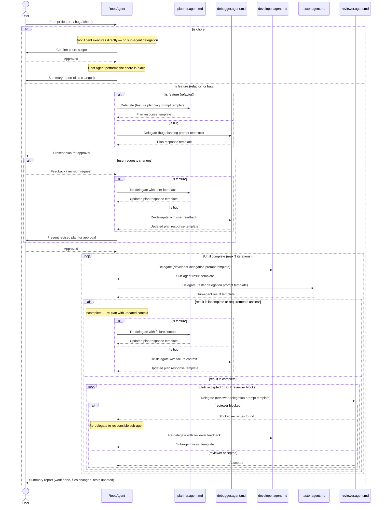

# AGENT WORKFLOW

---

## Overview

The **root agent** is the default agent activated when the user opens CLI or chat interface. It acts as the orchestrator of the entire workflow. It never implements directly — it classifies, delegates, validates, and reports.

---

## Workflow

---

## Step-by-Step Instructions

### Step 1 — Classification (Root Agent)

When a user prompt arrives, the root agent **must classify the intent** before doing anything else.

**Decision logic:**

- If the prompt describes **new functionality or a refactor** → classify as `feature`
- If the prompt describes a **chore** (dependency update, config change, tooling setup, lint-driven cleanup, or other small low-risk operation that does not touch business logic) → classify as `chore`
- If the prompt describes **unexpected behavior, a failure, or a regression** → classify as `bug`

> Use the classification skill to structure this decision.  
> Skill reference: [classification](./skills/classification/SKILL.md)

> **Chore fast-path:** chores skip the planning, delegation, and review pipeline. The Root Agent executes them directly. See **Step 2 — `chore`** below.

---

### Step 2 — Planning

#### If `chore`:

The Root Agent **executes the chore directly** — no delegation to `planner.agent.md`, `debugger.agent.md`, `developer.agent.md`, `tester.agent.md`, or `reviewer.agent.md`.

The Root Agent must:

- Confirm the scope and the file(s) affected with the user before making any changes
- Wait for explicit user approval of that scope confirmation
- Perform the change in-place (dependency bump, config tweak, tooling setup, lint-driven cleanup, etc.)
- Skip Steps 3, 3.5, 4, 5, 6, and 7 entirely
- Proceed directly to **Step 8 (Summary Report)** after execution

If during execution the change turns out to be larger than expected, touches business logic, or risks regressions, the Root Agent **must stop**, re-classify the request as `feature` or `bug`, and resume from Step 2 with the new classification. Do not silently expand scope.

#### If `feature`:

Delegate to **`planner.agent.md`** in **plan mode** using the feature planning prompt template.

> Prompt template skill: [delegation-prompt](./skills/delegation-prompt/SKILL.md) — `Feature Planning Prompt`

The delegation message must include:

- Original user prompt
- Classification result and rationale
- Any relevant context from the codebase

#### If `bug`:

Delegate to **`debugger.agent.md`** in **plan mode** using the bug fix prompt template.

> Prompt template skill: [delegation-prompt](./skills/delegation-prompt/SKILL.md) — `Bug Planning Prompt`

The delegation message must include:

- Original user prompt
- Observed vs. expected behavior (if available)
- Any stack traces, logs, or reproduction steps

---

### Step 3 — Plan Return

`planner.agent.md` or `debugger.agent.md` must return a structured plan to the root agent using the **plan response template**.

> Plan response template skill: [agent-response-template](./skills/agent-response-template/SKILL.md) — `Plan Response Template`

The plan must include:

- Summary of the implementation or fix approach
- Ordered list of tasks
- Identified sub-agents required (developer / tester)
- Open questions or blockers (if any)

---

### Step 3.5 — User Approval Gate

> **Chore fast-path:** this step does not apply to `chore`. Chores get a lighter scope-confirmation gate inside Step 2 instead of the full plan-approval gate described below.

Before any implementation begins, the root agent **must present the plan to the user and wait for explicit approval**.

Present the following to the user:

- The plan summary and approach
- The full task list with assigned agents
- Files in scope
- Any open questions or blockers flagged by the planner/debugger

**Decision logic:**

| User Response    | Root Agent Action                                                                                      |
| ---------------- | ------------------------------------------------------------------------------------------------------ |
| Approved         | Create markdown file based on plan response in **Doc Directory** as memory, then proceed to **Step 4** |
| Requests changes | Re-delegate to planner or debugger with user feedback, then re-present the revised plan                |
| Cancels / aborts | Stop the workflow and acknowledge                                                                      |

> The root agent must **not proceed to execution** until the user has explicitly approved the plan. This gate applies on every planning cycle, including re-plans triggered by incomplete results.

---

### Step 4 — Delegation to Sub-Agents

The root agent reads the plan and delegates to the appropriate sub-agent(s).

> **Key rule — Skill Scanning:** Before composing any delegation prompt, the root agent **must scan the `skills/` directory** and identify all skill files relevant to the task domain. These must be listed explicitly in the `Skill references` field of the delegation prompt. Sub-agents are responsible for reading and applying every skill listed. Do not delegate without populated skill references.

#### Delegate to `developer.agent.md`:

Use the developer delegation prompt template.

> Prompt template skill: [delegation-prompt](./skills/delegation-prompt/SKILL.md) — `Developer Delegation Prompt`

Include:

- Full implementation plan
- Specific task(s) for this agent
- File scope and constraints
- All relevant skill references (scanned from `skills/`)

#### Delegate to `tester.agent.md`:

Use the tester delegation prompt template.

> Prompt template skill: [delegation-prompt](./skills/delegation-prompt/SKILL.md) — `Tester Delegation Prompt`

Include:

- Full implementation plan
- What to test (unit / integration / e2e)
- Expected behavior to validate
- All relevant skill references (scanned from `skills/`)

---

### Step 5 — Sub-Agent Result Return

`developer.agent.md` and `tester.agent.md` must return results to the root agent using the **sub-agent result template**.

> Result template skill: [agent-response-template](./skills/agent-response-template/SKILL.md) — `Sub-Agent Result Template`

The result must include:

- Status: `complete` | `incomplete`
- Summary of work done
- Files changed
- Blockers or missing requirements (if incomplete)

---

### Step 6 — Completeness Check (Root Agent)

The root agent evaluates the returned result:

| Condition                                          | Action                                                 |
| -------------------------------------------------- | ------------------------------------------------------ |
| Status is `incomplete` or requirements are unclear | Loop back to **Step 2** (re-plan with updated context) |
| Status is `complete`                               | Proceed to **Step 7** (review)                         |

When looping back, the root agent must pass:

- The original prompt
- The previous plan
- The failure reason or missing requirement from the sub-agent result

---

### Step 7 — Review

Delegate to **`reviewer.agent.md`** using the reviewer delegation prompt template.

> Prompt template skill: [delegation-prompt](./skills/delegation-prompt/SKILL.md) — `Reviewer Delegation Prompt`

Include:

- Summary of all work done
- Files changed
- Original user requirement
- All relevant skill references (scanned from `skills/`)

#### Reviewer response:

| Reviewer Decision            | Root Agent Action                                                                     |
| ---------------------------- | ------------------------------------------------------------------------------------- |
| `blocked` — issues found     | Loop back to **Step 4** (re-delegate to responsible sub-agent with reviewer feedback) |
| `accepted` — output is valid | Proceed to **Step 8**                                                                 |

---

### Step 8 — Summary Report to User

The root agent compiles and presents a final summary to the user.

The summary must include:

- What was done (feature implemented / bug fixed)
- Files changed
- Tests added or updated
- Any outstanding notes or follow-up recommendations

---

## Loop Guard

To prevent infinite loops, the root agent must track **loop iterations per session**.

- After **3 consecutive incomplete cycles** on the same task → surface the blockers to the user and request clarification before continuing.
- After **2 consecutive reviewer blocks** on the same output → surface reviewer feedback to the user and ask whether to proceed or abort.
