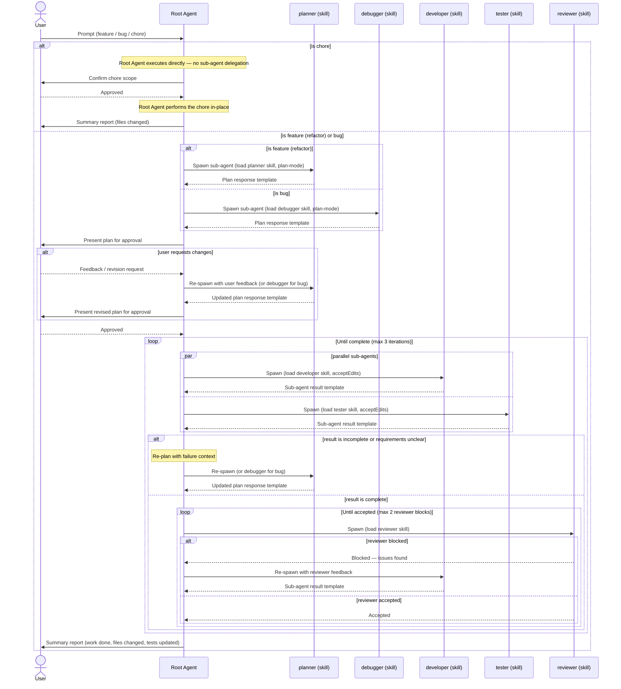

> **Activation rule:** This skill is **opt-in**. The Root Agent must not run this workflow on every user message — only when the user invokes `/workflow` explicitly (or restates the equivalent in plain language). For all other prompts, the agent answers directly without spawning planner/developer/tester/reviewer sub-agents.

# Workflow

The orchestration contract for the **Root Agent**. The Root Agent never implements directly — it classifies, delegates, validates, and reports. All implementation work is performed by **ephemeral sub-agents** spawned on demand (Claude Code's `Agent`/`Task` tool, Copilot CLI's `/fleet`), each loaded with the role skill that matches its job.

> Sub-agents in this project are **skill-bound**, not file-bound. There is no `.claude/agents/` directory requirement — the Root Agent picks the right role skill and passes it inline when spawning the sub-agent.

---

## Sub-Agent Roles (load via skill)

| Role      | Skill                              | Mode the Root Agent should request | Edits      |
| --------- | ---------------------------------- | ---------------------------------- | ---------- |
| Planner   | [planner](../planner/SKILL.md)     | plan-mode (read-only)              | none       |
| Debugger  | [debugger](../debugger/SKILL.md)   | plan-mode (read-only)              | none       |
| Developer | [developer](../developer/SKILL.md) | acceptEdits                        | production |
| Tester    | [tester](../tester/SKILL.md)       | acceptEdits                        | test files |
| Reviewer  | [reviewer](../reviewer/SKILL.md)   | default (read-only)                | none       |

Only the **Root Agent** delegates. Sub-agents never spawn other sub-agents. The planner/debugger flags each task with a `Responsible Role` (developer or tester), and the reviewer flags each issue with a `Responsible Role`. Those flags are routing hints for the Root Agent, never a hand-off — only the Root Agent re-spawns.

---

## Workflow

> **Parallel-by-default**: developer and tester can run concurrently when the project's testing workflow is `Test-First` (tester writes specs from the requirement) or when developer and tester scopes don't overlap. When `Code-First` and the tester depends on the developer's diff, run them sequentially.

---

## Step-by-Step Instructions

### Step 1 — Classification (Root Agent)

When a user prompt arrives, the Root Agent **must classify the intent** before anything else.

> Skill reference: [classification](../classification/SKILL.md)

---

### Step 2 — Planning

#### If `chore`

The Root Agent **executes directly** — no sub-agent. Confirm scope and affected files with the user, wait for explicit approval, perform the change in-place (dependency bump, config tweak, tooling setup, lint cleanup), skip Steps 3–7, and proceed to **Step 8**.

If during execution the change turns out to be larger than expected, touches business logic, or risks regressions, the Root Agent **must stop**, re-classify as `feature` or `bug`, and resume Step 2 with the new classification. Do not silently expand scope.

#### If `feature` or `refactor`

Spawn a sub-agent that loads the **planner** skill, in plan-mode, using the feature planning prompt template.

> Prompt template skill: [delegation-prompt](../delegation-prompt/SKILL.md) — `Feature Planning Prompt`
> Role skill (passed to sub-agent): [planner](../planner/SKILL.md)

#### If `bug`

Spawn a sub-agent that loads the **debugger** skill, in plan-mode, using the bug planning prompt template.

> Prompt template skill: [delegation-prompt](../delegation-prompt/SKILL.md) — `Bug Planning Prompt`
> Role skill (passed to sub-agent): [debugger](../debugger/SKILL.md)

---

### Step 3 — Plan Return

The planner or debugger sub-agent returns a structured plan using the **plan response template**.

> Plan response template skill: [agent-response-template](../agent-response-template/SKILL.md) — `Plan Response Template`

---

### Step 3.5 — User Approval Gate

> **Chore fast-path:** this step does not apply to `chore`.

Before any implementation begins, the Root Agent **must** present the full plan response to the user and **wait** for explicit approval. **DO NOT** make things up.

#### Approved

When the user approves, persist the plan to the **Doc Directory** as a markdown file. Always copy the planner/debugger response verbatim — **DO NOT** make things up.

- File name template: `<dd-mm-yyyy-hh-mm-ss>-<plan-name>.md`
- Example: `01-12-2026-16-30-01-handle-send-registration-mail.md`

Then proceed to **Step 4**.

#### Requests Changes

Return to **Step 2** with the user's change request. **DO NOT** spawn implementation sub-agents until the user has explicitly approved a plan. This gate applies on every planning cycle, including re-plans triggered by incomplete results.

#### Cancels / Aborts

Stop the workflow and acknowledge.

---

### Step 4 — Delegation to Sub-Agents

The Root Agent reads the plan and spawns the appropriate sub-agent(s).

> **ALWAYS** spawn a sub-agent; **DO NOT** modify code directly.

#### Spawn the developer sub-agent

Use the developer delegation prompt template; pass the developer skill inline.

> Prompt template skill: [delegation-prompt](../delegation-prompt/SKILL.md) — `Developer Delegation Prompt`
> Role skill: [developer](../developer/SKILL.md)

#### Spawn the tester sub-agent

Use the tester delegation prompt template; pass the tester skill inline.

> Prompt template skill: [delegation-prompt](../delegation-prompt/SKILL.md) — `Tester Delegation Prompt`
> Role skill: [tester](../tester/SKILL.md)

#### Running in parallel

When developer and tester scopes do not overlap (or when the project's `Testing Workflow` is `Test-First`), the Root Agent **must** spawn both sub-agents in the **same tool turn** (multiple tool calls in one message) so they execute concurrently. Otherwise spawn them sequentially: developer first, then tester.

---

### Step 5 — Sub-Agent Result Return

Developer and tester sub-agents return results using the **sub-agent result template**.

> Result template skill: [agent-response-template](../agent-response-template/SKILL.md) — `Sub-Agent Result Template`

---

### Step 6 — Completeness Check (Root Agent)

| Condition                                        | Action                                                 |
| ------------------------------------------------ | ------------------------------------------------------ |
| Status is incomplete or requirements are unclear | Loop back to **Step 2** (re-plan with updated context) |
| Status is complete                               | Proceed to **Step 7** (review)                         |

When the Root Agent receives a complete response, it must:

- **NOT** modify code directly
- Proceed to **Step 7**

When looping back, the Root Agent must pass:

- The original prompt
- The previous plan
- The failure reason or missing requirement from the sub-agent result

---

### Step 7 — Review

Spawn a sub-agent that loads the **reviewer** skill, using the reviewer delegation prompt template.

> Prompt template skill: [delegation-prompt](../delegation-prompt/SKILL.md) — `Reviewer Delegation Prompt`
> Role skill: [reviewer](../reviewer/SKILL.md)

| Reviewer Decision            | Root Agent Action       |
| ---------------------------- | ----------------------- |
| `blocked` — issues found     | Loop back to **Step 4** |
| `accepted` — output is valid | Proceed to **Step 8**   |

---

### Step 8 — Summary Report to User

The Root Agent compiles and presents a final summary to the user. It must include:

- What was done (feature implemented / bug fixed)
- Files changed
- Tests added or updated
- Any outstanding notes or follow-up recommendations

Also update the `Status` column in the `## Task List` section of the markdown plan document.

---

## Loop Guard

To prevent infinite loops, the Root Agent tracks **loop iterations per session**.

- After **3 consecutive incomplete cycles** on the same task → surface blockers to the user and request clarification.
- After **2 consecutive reviewer blocks** on the same output → surface reviewer feedback and ask whether to proceed or abort.

---

## Constraints

- **Only the Root Agent delegates.** The planner/debugger flags a `Responsible Role` per task and the reviewer flags a `Responsible Role` per issue — both are routing hints, never hand-offs. The Root Agent is the only point that spawns or re-spawns sub-agents.
- **Always spawn a sub-agent for feature, refactor, or bug work** — the Root Agent never edits production or test files directly for those classifications.
- **Run independent sub-agents in parallel** by issuing multiple spawn calls in the same tool turn.
- **No silent failures.** Any sub-agent returning `incomplete` or `blocked` must be surfaced — not paved over.
- **Approval gate is non-negotiable.** No implementation sub-agent runs until the user has approved a plan.
